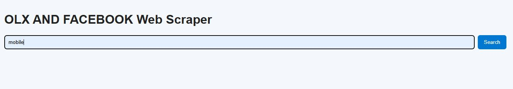
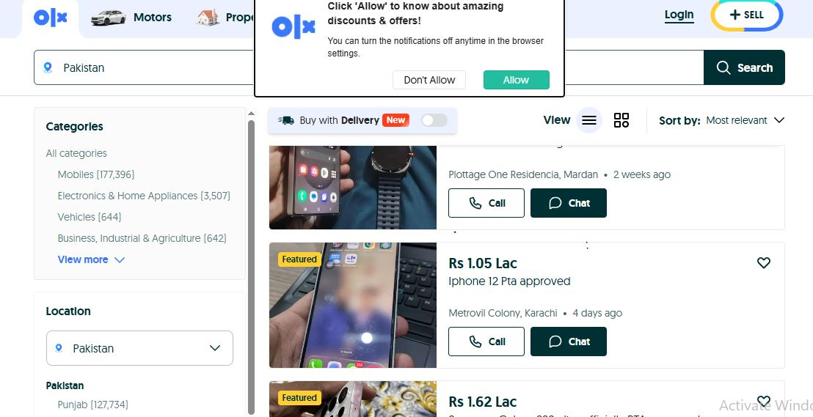
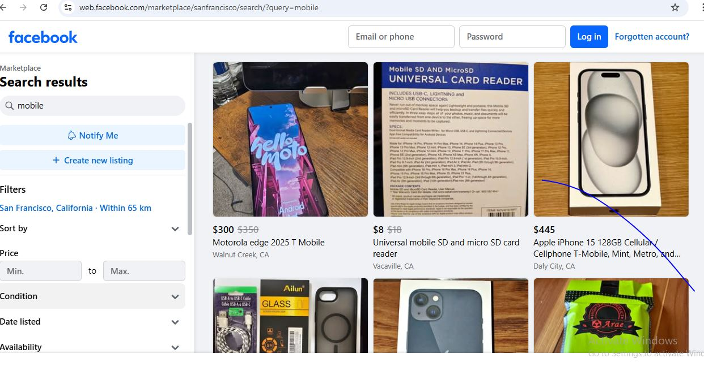
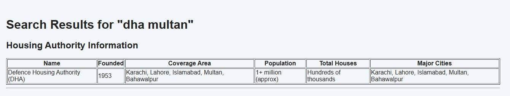

# Multi-Platform Product Scraper

This project is a **Flask-based web scraping application** that collects product listings from multiple platforms such as **OLX**, **Facebook Marketplace**, and **Real Estate searches**.

The application allows users to search for products and view results from multiple platforms in a simple web interface.

---

## Features

* Scrape product listings from **OLX**
* Scrape product listings from **Facebook Marketplace**
* Search **real estate housing societies**
* Display results in a simple web interface
* Multi-platform product search

---

## Technologies Used

* Python
* Flask
* Playwright
* BeautifulSoup
* HTML
* CSS
* Jinja2 Templates

---

## Project Structure

```
olx_scrapper
│
├── app.py
├── static/
│   └── style.css
├── templates/
│   ├── index.html
│   └── results.html
├── screenshots/
│   ├── WebPage.JPG
│   ├── olx.JPG
│   ├── facebook.JPG
│   └── realstate.JPG
```

---

## Screenshots

### Main Web Page



---

### Scraped Product Results

| OLX Results              | Facebook Results              |
| ------------------------ | ----------------------------- |
|  |  |

---

### Real Estate Search



---


## License

This project is licensed under the MIT License.
